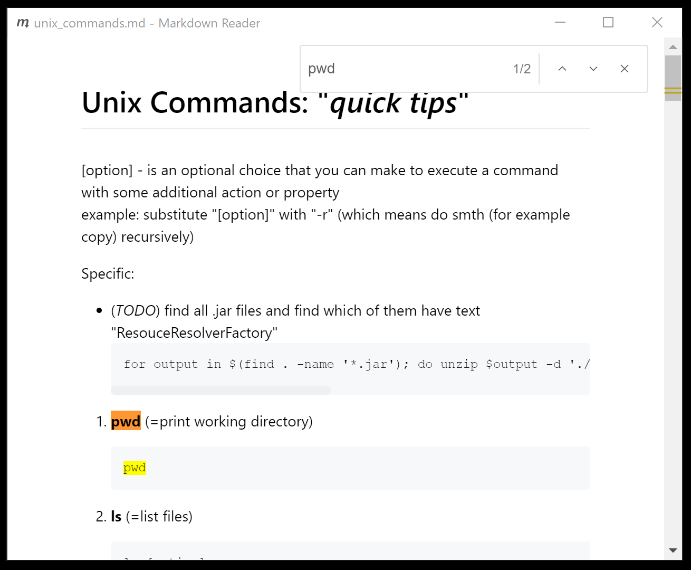
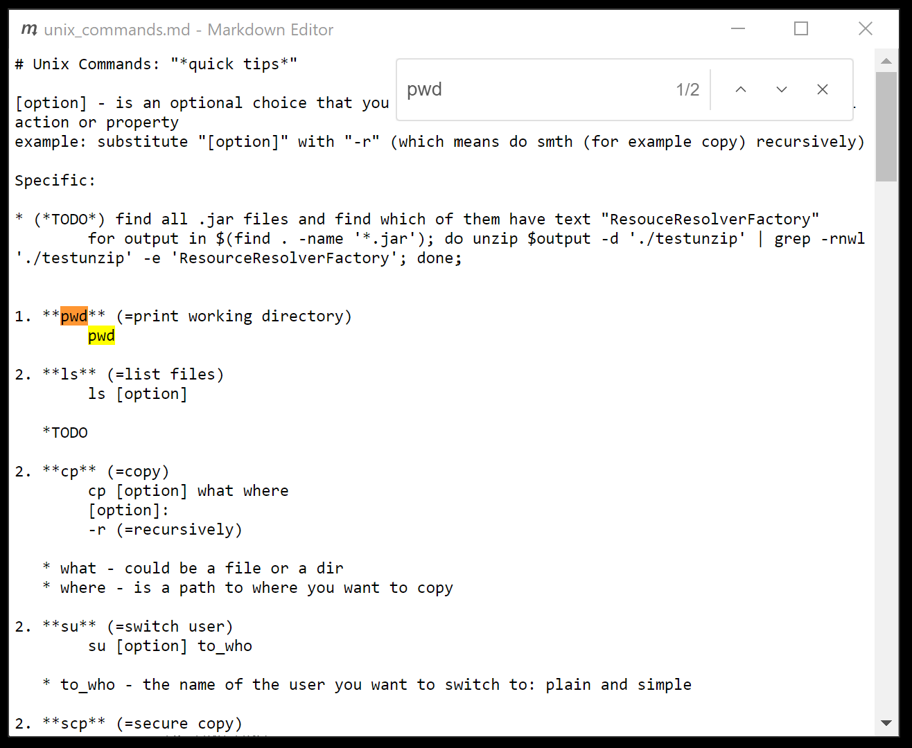

# electron-markdown

## Description

Desktop ElectronJS project to view/edit markdown files

## How to use

If you have **ElectronJS** installed on your computer

	electron /path/to/project/dir/ /markdown/file/location

To make a standalone app out of this project check out this [link](https://www.electronjs.org/docs/tutorial/application-distribution).

***

## Features

Supports shortcuts:

1. Editor window `F4` - opens editor window, where user can live-edit markdown file

1. Save `Ctrl+S` - saves changes, works in both viewer and editor windows

1. Search `(Ctrl+F)` - searches text, works separately for both viewer and editor windows

	
	

***

## Bugs

- If several files are opened, closing one and then trying to reopen it disallows openning any more files

***
